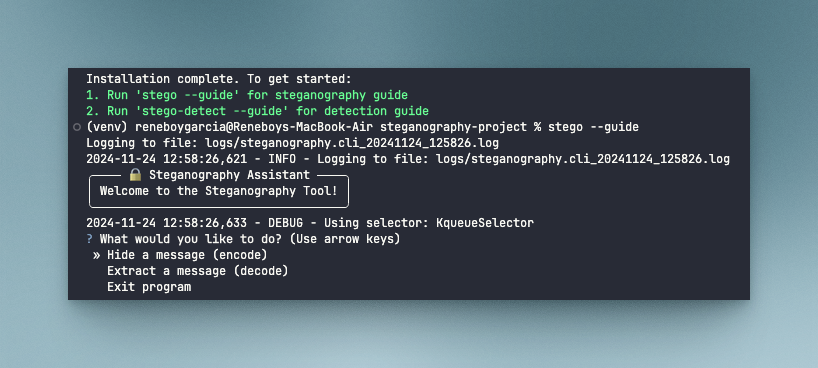

# Stego Tool

A command-line tool for steganography operations and hidden message detection.

## Quick Setup

1. Set up development environment:
```bash
make dev-setup
```

2. Activate the virtual environment:
```bash
# On Linux/Mac
source .venv/bin/activate

# On Windows
.venv\Scripts\activate
```

3. Install dependencies:
```bash
make install
```

## Usage Guide

### For Encoding/Decoding Messages

Run the interactive guide:
```bash
stego --guide
```

The guide will walk you through:
- Selecting encode/decode mode
- Choosing input image
- Setting message content (for encoding)
- Saving output files

### For Detecting Hidden Messages

Run the detection guide:
```bash
stego-detect --guide
```

The guide will help you:
- Select input image(s) for analysis
- Choose detection algorithms
- View detection results
- Generate analysis reports

## Examples

### Encoding a message
```bash
# Following the guide
stego --guide

# Direct command
stego encode -i original.png -m "secret message" -o encoded.png
```

### Detecting hidden content
```bash
# Following the guide
stego-detect --guide

# Direct command
stego-detect analyze -i suspicious.png --report
```

## Requirements

- Python 3.8+
- OpenCV
- NumPy
- Pillow

### Inspired by the Community

This project is inspired by the post from [GeniusGTX](https://x.com/GeniusGTX/status/1813555701702353335).

